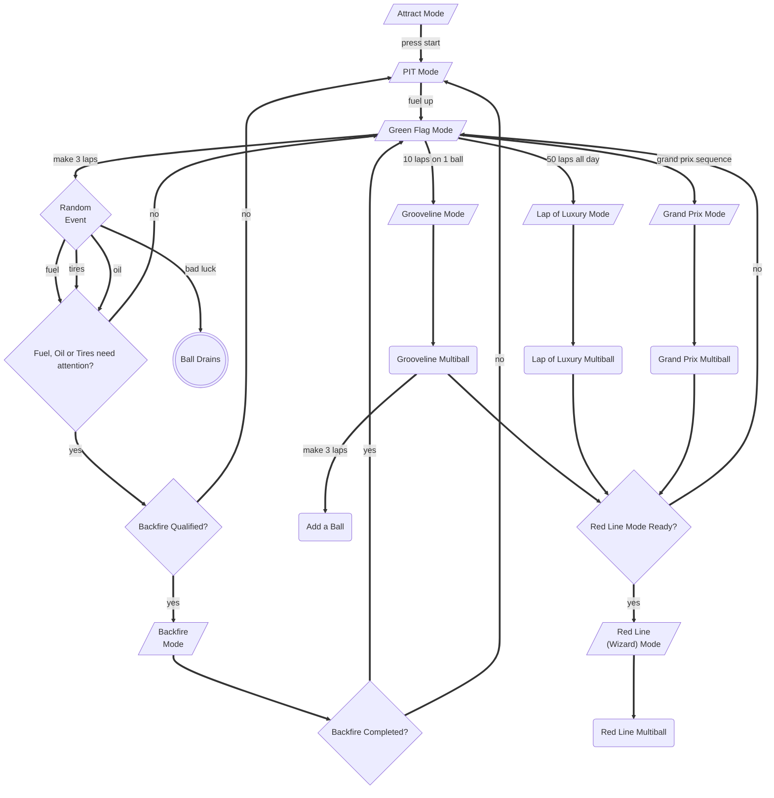

Grand Prix '86
==============

Grand Prix '86 is an attempt at a solid-state conversion / re-theme
of the 1976
[EM Pinball Machine](http://www.ipdb.org/machine.cgi?id=1072)
by Williams.

### Rules

**Proposed rules [can be found from here](https://github.com/deathsave/grand-prix/blob/main/docs/RULES.md).**

### Docs

A simple web server is included to serve up the markdown docs and
Mermaid diagrams. To setup, run `pip install -r requirements.txt`
in the `./web/` root. Then to run it, use `bin/docs`.

### Production Machine Setup

Hardware is as such:

- [Mini 5" HDMI Display](https://www.amazon.com/dp/B0CP3DH3LN)
- [MLLSE M2 Mini PC](https://www.newegg.com/mllse-m2/p/2SW-00A4-00007)
- [OPP "Cypress" Pinball Interface](https://pinballmakers.com/wiki/index.php?title=OPP-Cypress)
- [My Pinballs Segment Display](https://missionpinball.org/latest/hardware/mypinballs/wiring/)
- [FadeCandy LED Controller](https://www.adafruit.com/product/1689)

**A guide to setup the [production machine on Xubuntu is here](https://github.com/deathsave/grand-prix/blob/main/docs/XUBUNTU.md).**

Proposed OPP Build
------------------

OPP boards can each have up to 4 wings attached as shown:

### Board Switch Mapping

For latest, see
[Google Sheet](https://docs.google.com/spreadsheets/d/1fP1gkxzNxdvTTTq80cS0wRv1wayha4IzK5jE9S3geUE/edit?usp=sharing).

### Setup for MacOS

See the [MacOS Setup Guide](https://github.com/deathsave/combat/blob/main/README.md#installing-mpf)
from our other project Combat.

### Running

- **Development** - `bin/dev` will run both `mpf` and `mpf-mc`
  without the console GUI. It will also run `mpf monitor` so you can
  interact with it.
- **Production** - `bin/run` will run for production using the real
  hardware devices and the console GUI.
- **Test** - Run a test with `bin/test tests/test_something.py` or
  simply `bin/test` to run all tests from the `./tests` folder.
