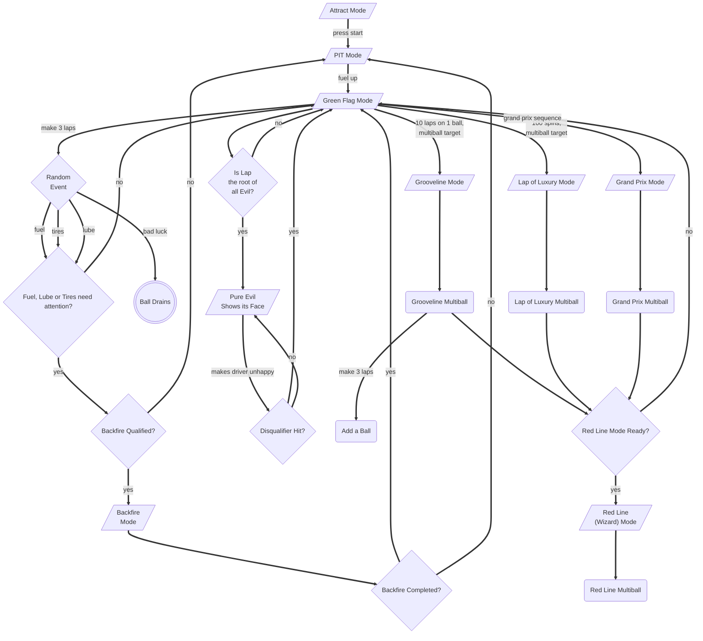

Overview
========

Running the Game
----------------

- **Development** - `bin/dev` will run both `mpf` and `mpf-mc`
  without the console GUI. It will also run `mpf monitor` so you can
  interact with it.
- **Production** - `bin/run` will run for production using the real
  hardware devices and the console GUI.
- **Test** - Run a test with `bin/test tests/test_something.py` or
  simply `bin/test` to run all tests from the `./tests` folder.

Synthesis Call outs
-------------------

We used the built-in macOS `say` command to generate these and the
"Tritik Krush" VST plugin to bit-crush them.

`say -v "Vicki" "Let's race\!" -o sounds/preload/voice/synth/player-up4.ogg`

Flowchart
---------

This is a rough idea of how things work together.

